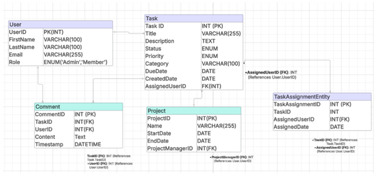
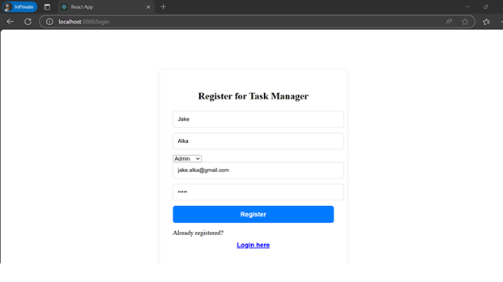
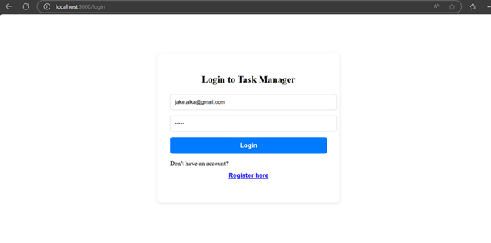
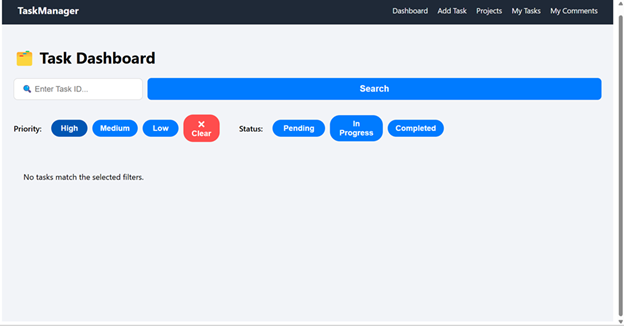
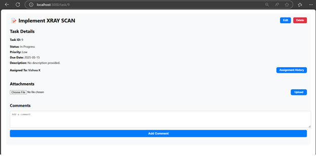
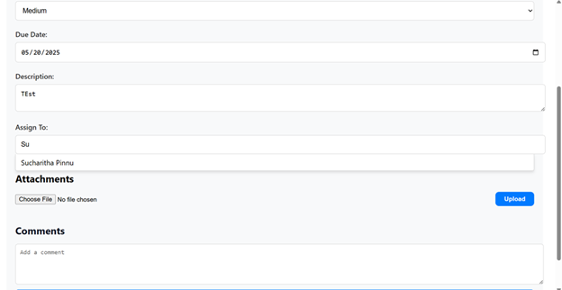
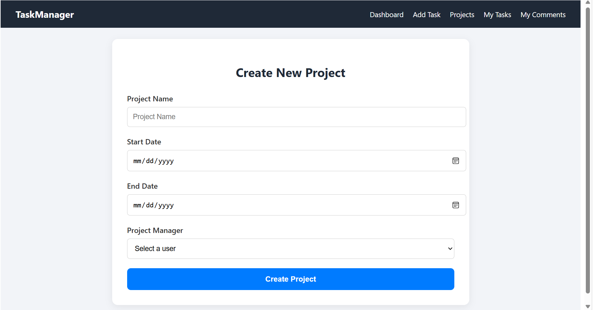
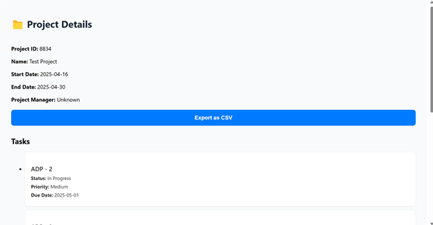

# Collaborative Task & Project Management System

A full-stack task and project management platform built for teams to organize, track, and collaborate efficiently. The app supports user roles, task assignments, project tracking, filtering, commenting, and secure authentication.

---

## Features

* **Task Management** – Create, update, assign, and delete tasks
* **User Authentication** – Secure login/signup with JWT and password hashing
* **Role-Based Access** – Admins vs Members: Different permissions
* **Task Filters** – Chip-style filters for status, priority, and project
* **Comments** – Threaded comment system with user filtering and date search
* **File Uploads** – Attach documents to tasks with controlled access
* **Smart Assignment** – Searchable dropdown to assign tasks to users
* **Project Dashboard** – View tasks by project with sorting & export options
* **Backend Optimization** – Stored procedures for efficient task filtering
* **Built With**: React, Node.js, Express, SQL, JWT

---

## Tech Stack

| Frontend | Backend           | Database           | Auth        |
| -------- | ----------------- | ------------------ | ----------- |
| React.js | Node.js (Express) | MySQL / PostgreSQL | JWT, Bcrypt |

---

## Entity Relationship Diagram



### Signup


### Login


### Dashboard View


### Create Task Form


### Task Details View


### Task Assignment


### Project Creation


### Project Tasks View


---

## ⚙️ Setup Instructions

1. **Clone the repository**

   ```bash
   git clone https://github.com/your-username/task-management-app.git
   cd task-management-app
   ```

2. **Install dependencies**

   ```bash
   # For frontend
   cd client
   npm install

   # For backend
   cd ../server
   npm install
   ```

3. **Configure environment variables**
   Create a `.env` file in `server/`:

   ```env
   PORT=5000
   DB_HOST=localhost
   DB_USER=youruser
   DB_PASS=yourpass
   DB_NAME=task_management
   JWT_SECRET=your_secret_key
   ```

4. **Run the app**

   ```bash
   # Backend
   cd server
   npm run dev

   # Frontend
   cd ../client
   npm start
   ```

