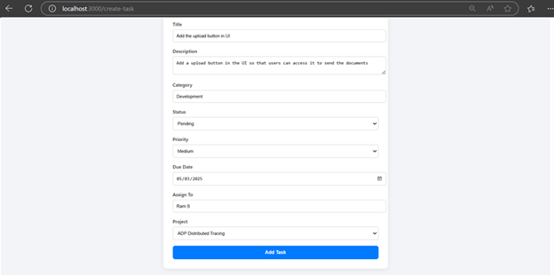

# Collaborative Task & Project Management System

A full-stack task and project management platform built for teams to organize, track, and collaborate efficiently. The app supports user roles, task assignments, project tracking, filtering, commenting, and secure authentication.

---

## Features

* **Task Management** – Create, update, assign, and delete tasks
* **User Authentication** – Secure login/signup with JWT and password hashing
* **Role-Based Access** – Admins vs Members: Different permissions
* **Task Filters** – Chip-style filters for status, priority, and project
* **Comments** – Threaded comment system with user filtering and date search
* **File Uploads** – Attach documents to tasks with controlled access
* **Smart Assignment** – Searchable dropdown to assign tasks to users
* **Project Dashboard** – View tasks by project with sorting & export options
* **Backend Optimization** – Stored procedures for efficient task filtering
* **Built With**: React, Node.js, Express, SQL, JWT

---

## Tech Stack

| Frontend | Backend           | Database           | Auth        |
| -------- | ----------------- | ------------------ | ----------- |
| React.js | Node.js (Express) | MySQL / PostgreSQL | JWT, Bcrypt |

---

## Entity Relationship Diagram


### Signup


### Login


### Dashboard View


### Create Task Form


### Task Details View


### Task Assignment


### Project Creation


### Project Tasks View


## 🛠️ Setup Instructions

Follow these steps to run the project locally.

---

### 1. **Clone the Repository**

```bash
git clone https://github.com/your-username/task-hive.git
cd Task-Hive
```

---

### 2. **Install Dependencies**

#### 🔧 Backend (Node.js + Express)

```bash
cd task-management-backend
npm install
```

#### 🎨 Frontend (React.js)

```bash
cd ../frontend
npm install
```

---

### 3. **Configure Environment Variables**

Set the variables of `.env` file in the `task-management-backend/` directory based on the provided input fields.

---

### 4. **Set Up the Database**

* Make sure MySQL is running.
* Create the `task_management` database.
* Run your schema and stored procedure SQL files (e.g., `schema.sql`, `procedures.sql`) to set up tables, relations, and logic.

```sql
CREATE DATABASE task_management;
-- Then import your schema file
```

---

### 5. **Start the Development Servers**

#### 🚀 Start Backend

```bash
cd task-management-backend
npm run dev
```

#### 🌐 Start Frontend

```bash
cd ../frontend
npm start
```

The app will be available at:
🔗 `http://localhost:3000` (Frontend)
🔗 `http://localhost:5000` (Backend API)


